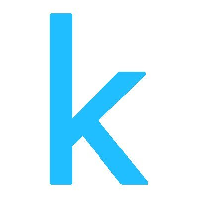

 
 

### Glad to see you here! :octocat:

---
### About 
👨🏻‍💻 Data Analyst & Aspiring Data Scientist sharing my journey and learnings in data and AI. 
🎓 Background in Computer Science with hands-on experience in Machine Learning & Analytics. 
📊 Passionate about turning raw data into meaningful insights and predictive solutions. 
🧠 Exploring the intersection of data, AI, and real-world decision-making. 
🌱 #learninginpublic — continuously improving my skills in Python, SQL, and visualization tools. 
📈 Currently working on projects in predictive modeling, dashboarding, and data storytelling. 

---

## 🧰 Tech Stack & Skills

**Languages & Databases**  

**Visualization & Apps**  

**Machine Learning & AI**  

**Web Development**  

**MLOps & DevOps**  

**Cloud**  

---
## 🎓 Education

- **MSc Data Science** — Dublin Business School, Ireland.(2:1 Honors)
- **Bachelors Computer Science** — Gayatri Vidya Parishad College of Engineering, India(8.1 CGPA)

---

  <h3>💻 Coding & Learning Profiles</h3>

&nbsp;&nbsp;&nbsp;&nbsp;&nbsp;

&nbsp;&nbsp;&nbsp;&nbsp;&nbsp;

&nbsp;&nbsp;&nbsp;&nbsp;&nbsp;

&nbsp;&nbsp;&nbsp;&nbsp;&nbsp;

---

## 📬 Get in Touch

&nbsp; &nbsp; &nbsp;
 &nbsp;
 &nbsp;

